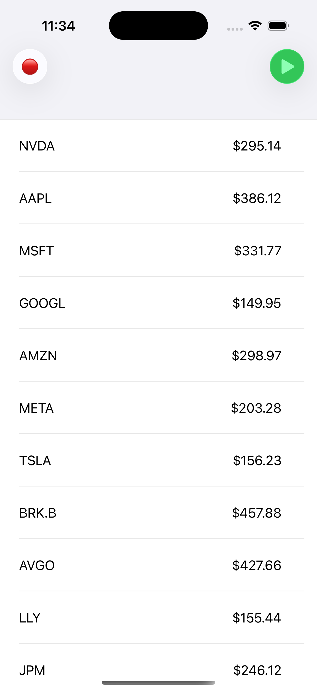
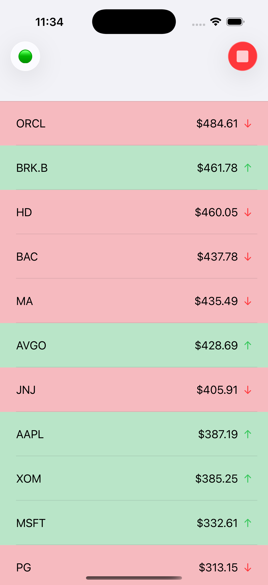
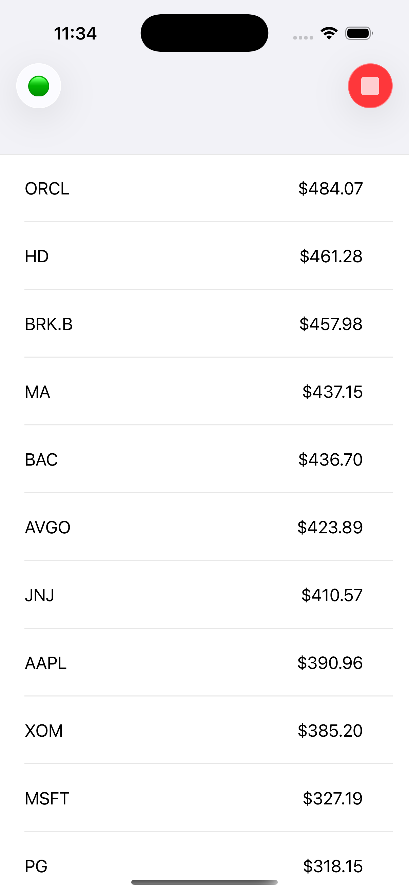
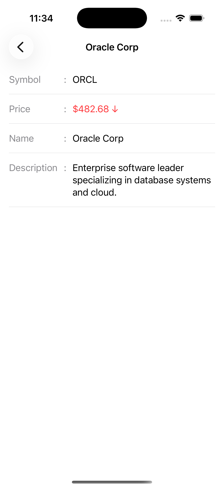
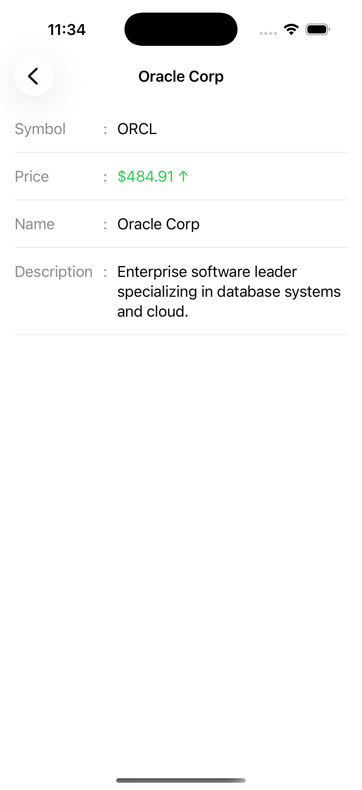

# StockPriceTracker

- Stock Price Tracker is a real-time SwiftUI application that simulates live stock price updates using WebSockets and Combine.

- The app tracks multiple stock symbols and updates their prices every 2 seconds. Prices are streamed through a WebSocket echo server and reflected live in the UI.

- The project demonstrates a production-ready architecture using MVVM, Clean Architecture principles, Combine streams, and dependency injection.

## Features

- [x] 25 stock list symbols
- [x] Real-time WebSocket integration
- [x] Sorted feeds based on stock prices
- [x] Price change indicator(↑/↓) 
- [x] Flash animation for price change
- [x] Connection status indicator
- [x] Start/Stop price streaming
- [x] Symbol detail with live price
- [x] Unit tests

## Quick Start
1. Prerequisites
   - Xcode 26.2 or newer (Swift 5.0+)
   - iOS 26.2+ deployment target
2. Clone and open
   - Clone the repository and open the `.xcodeproj` in Xcode.
3. Configure environment
   - Open `PDebug` in `EnvConfigs` folder and set the correct `BASE_URL` for your WebSocket endpoint.
4. Build & Run
   - Select a simulator and press Run.

## Tech Stack
- Language: Swift, Combine Framework
- UI: SwiftUI
- Networking: URLSession WebSocket
- Architecture: MVVM-Clean Architecture

## Architecture

The project follows a scalable **MVVM + Clean Architecture** structure.

```
Presentation (SwiftUI) 
    ↓ 
ViewModel
    ↓ 
UseCase / Business Logic 
    ↓ 
Repository 
    ↓ 
Data Source (WebSocket + Streaming Engine)
```

The app is organized for modularity and testability:

#### Dependency Injection
  - `DIContainer` (conforming to `DIContainerProtocol`) wires core services and exposes factories for view models.
  - A `MockDIContainer` exists for previews/tests.

#### Core
  - `WebSocketServiceProtocol` / `WebSocketService` manage the underlying WebSocket connection.

#### Data Layer
  - `PriceStreamingEngine` coordinates subscriptions and message routing.
  - `StockPriceRepositoryProtocol` / `StockPriceRepository` expose domain-friendly APIs to the rest of the app.

#### Domain Layer (Use Cases)
  - `StockObserverUseCaseImpl` — observe a list of stocks.
  - `TogglePriceUseCaseImpl` — enable/disable tracking for a symbol.
  - `StockDetailObserverUseCaseImpl` — observe a single stock’s detail.

#### Presentation Layer
  - `PriceListViewModel` — consumes observer + toggle use cases for the list screen.
  - `StockDetailViewModel` — consumes the detail observer use case for a specific symbol.
  - SwiftUI views bind to these view models for rendering.

## Data Flow (Combine)
The app uses **Combine publishers** for real-time updates.

Example pipeline:
```
WebSocket messagePublisher
    ↓
StockPriceRepository stockPublisher
    ↓
StockObserverUseCase execute()
    ↓
PriceListViewModel
    ↓
SwiftUI View
```

UI automatically updates when the publisher emits new values.

## Screenshot / Video

- Screenshots

<div align="left">
  
  
  
  
  
</div>

- Video
  
[`PriceTrackerApp.mov`](docs/Video/PriceTrackerDemo.mov)

[PriceTrackerApp.mov]()